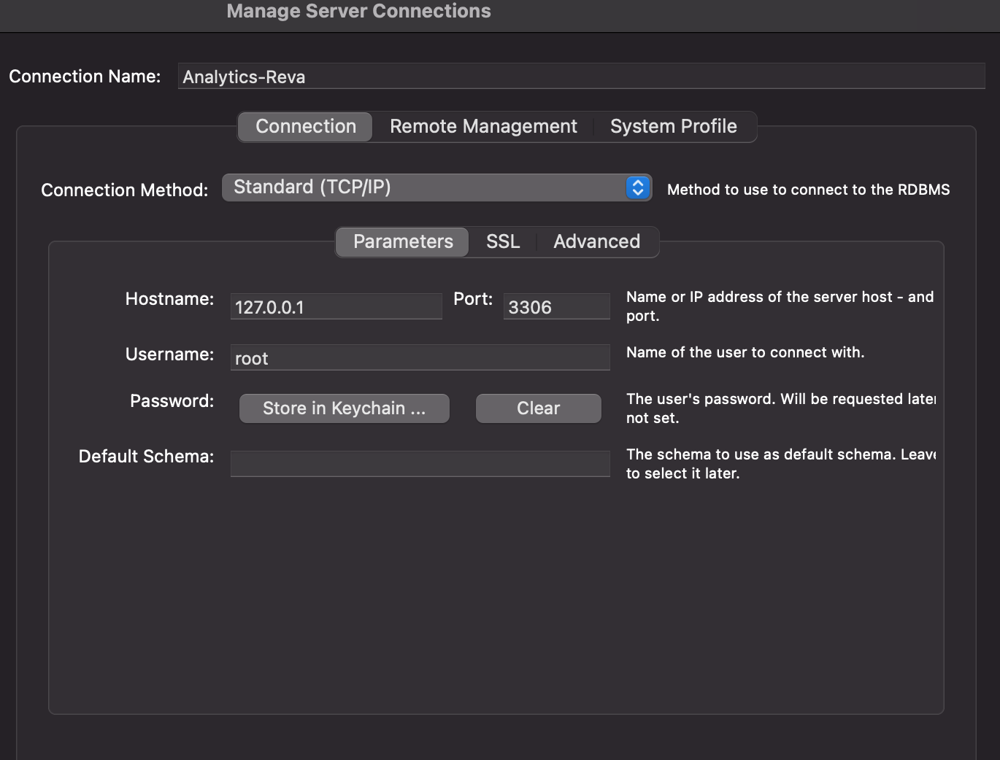
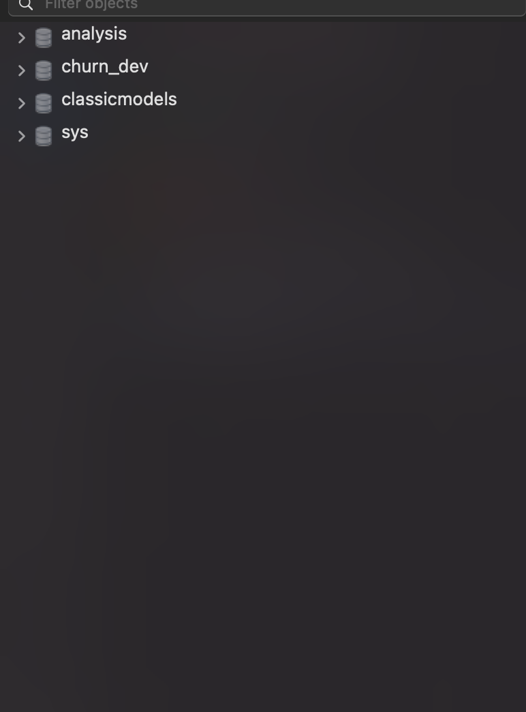

# SQL Assignment REVA University 

This site contains the SQL Assignment 

1. Create MySQL Connection on Local System

2. Create Database to for the Analysis 

3. Create 2 tables Churn and Customers

4. Load the data into these tables

# Create MySQL Connection on Local System

# Create Database to for the Analysis 

1. Create Database with "CREATE DATABASE <DATABSE BASE NAME>" 
  

